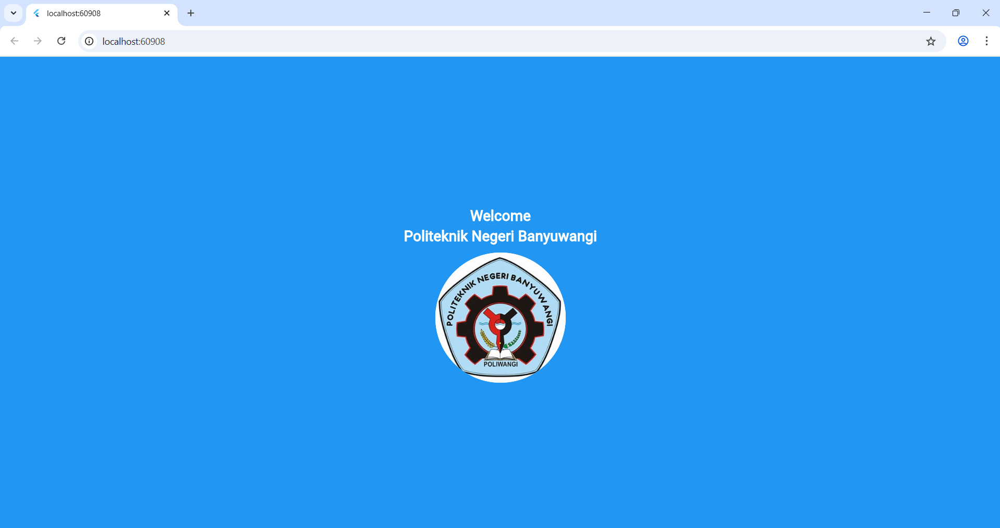

# Praktikum 1 - Flutter Welcome Screen

## Langkah-langkah Coding

1. **Inisialisasi Project Flutter**
   - Buat project baru dengan perintah:
     ```
     flutter create praktikum_1
     ```
   - Masuk ke folder project:
     ```
     cd praktikum_1
     ```

2. **Struktur Folder**
   - Pastikan struktur folder seperti berikut:
     ```
     praktikum_1/
     ├── assets/images/logo.jpg
     └── lib/
         ├── main.dart
         ├── images_widget.dart
         └── text_widget.dart
     ```

3. **Membuat Widget Teks**
   - Buat file `text_widget.dart` di folder `lib`.
   - Isi dengan kode widget untuk menampilkan teks sambutan.

4. **Membuat Widget Gambar/Logo**
   - Buat file `images_widget.dart` di folder `lib`.
   - Isi dengan kode widget untuk menampilkan gambar/logo di dalam lingkaran.

5. **Mengedit main.dart**
   - Import kedua widget (`text_widget.dart` dan `images_widget.dart`).
   - Gunakan kedua widget tersebut di dalam widget utama (`WelcomeScreen`).

6. **Menambahkan Gambar**
   - Tambahkan file gambar (misal: `logo.jpg`) ke dalam folder `images` di dalam folder `lib` atau di root project.
   - Daftarkan gambar pada file `pubspec.yaml`:
     ```yaml
     flutter:
       assets:
         - images/logo.jpg
     ```

7. **Menjalankan Aplikasi**
   - Jalankan aplikasi dengan perintah:
     ```
     flutter run
     ```

## Hasil
Aplikasi akan menampilkan layar sambutan dengan teks dan logo di tengah layar dengan latar belakang biru.

---

**Catatan:**  
Pastikan semua file sudah diimport dengan benar dan path gambar sesuai dengan struktur folder project

